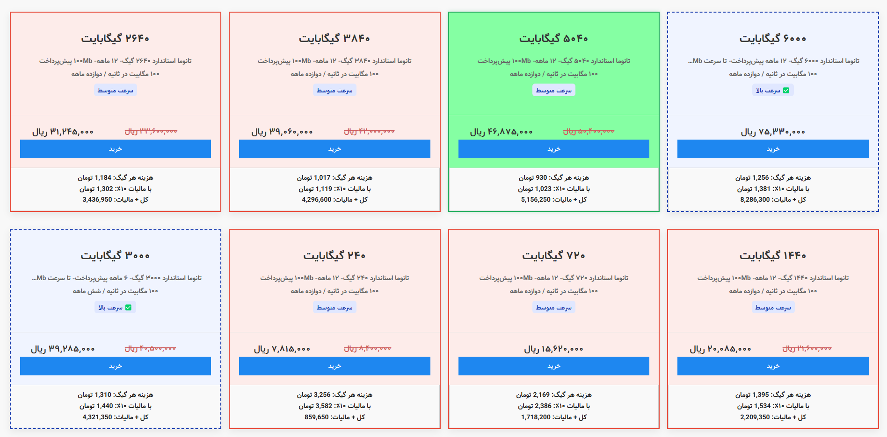

<h1 align="center">Internet Price and Speed Highlighter</h1>

<p align="center">🔍 افزونه کروم برای محاسبه و هایلایت خودکار قیمت هر گیگابایت در بسته‌های اینترنتی مخابرات ایران</p>

---

## 📸 پیش‌نمایش

<p align="center">
  
</p>

---

## 💡 ویژگی‌ها
- محاسبه خودکار **قیمت هر گیگابایت (تومان/GB)**
- دسته‌بندی رنگی بسته‌ها:
  - 🟢 **Best**: ارزان‌ترین
  - 🟩 **Good**: کمتر از میانگین
  - 🟥 **Bad**: بیشتر از میانگین
  - 🔵 **Fast**: سرعت بالا
- بروزرسانی خودکار هنگام تغییر محتوا
- API عمومی برای اجرای دستی

---

## 🌐 سایت‌های پشتیبانی‌شده
🔗 [adsl.tci.ir](https://adsl.tci.ir)

---

## 🚀 نصب افزونه

### از سورس (نصب دستی)
1. این مخزن را کلون یا دانلود کنید.
2. وارد `chrome://extensions/` شوید.
3. حالت "Developer Mode" را فعال کنید.
4. روی "Load unpacked" کلیک کرده و پوشه پروژه را انتخاب کنید.

📎 اجرای دستی در کنسول:
```js
window.ipgbHighlight();
